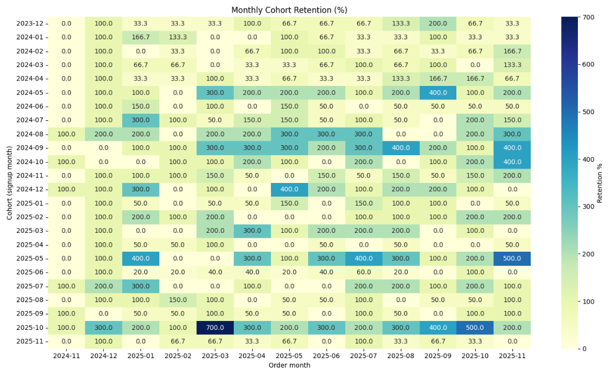
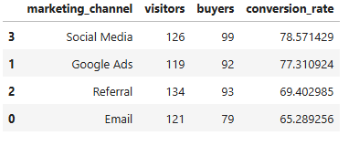
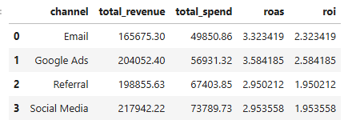

# E-Commerce Analytics Project

This project simulates a small online shop and builds a complete end-to-end analytics workflow.  
It includes data generation, database design, funnel analysis, cohort analysis, customer value modelling, and basic marketing ROI.

The goal is to mirror the type of work carried out by data analysts in real e-commerce teams.
## Visual Summary

### Cohort Retention Heatmap
This heatmap shows how each signup cohort behaves over time.  
It illustrates the percentage of users who remain active (place at least one order) in the months following signup.

 ### Funnel Performance by Channel
This table compares how different marketing channels perform in terms of visitors, buyers, and conversion rate.

### Marketing ROI by Channel
This table compares channel-level spend and the revenue generated, along with ROAS (Return on Ad Spend) and ROI.

---

## 🔍 Project Overview

The project covers the full analytics cycle:

1. **Simulating realistic e-commerce data**  
   Users, sessions, products, orders, order items, and marketing spend.

2. **Building a structured SQL database**  
   Using SQLite for a lightweight but fully functional data warehouse.

3. **Funnel analysis**  
   Visitor → Buyer conversion and performance by marketing channel.

4. **Cohort analysis**  
   Retention patterns based on user signup month.

5. **Customer Lifetime Value (CLV)**  
   A simple model based on recency, frequency, and monetary value.

6. **Marketing ROI**  
   Comparing channel spend against revenue generated.

All code, SQL, and outputs are included in the `notebooks/` and `sql/` folders.

---

## 📂 Folder Structure

ecommerce_analytics_project/
│
├── data/
│ ├── raw/ # Simulated CSV files
│ └── processed/ # SQLite DB and processed outputs
│
├── notebooks/
│ ├── 00_generate_data.ipynb
│ ├── 01_build_database.ipynb
│ └── 02_analysis.ipynb
│
├── sql/ # Any standalone SQL scripts
├── dashboard/ # (Optional) Visual dashboards
└── report/ # Business summary / write-up

yaml
Copy code

---

## 🧪 1. Data Generation

Synthetic datasets were created using Python and Faker.  
This mirrors a miniature e-commerce environment, including:

- Users and signup details  
- Website sessions  
- Orders and order items  
- Product catalogue  
- Monthly marketing spend  

All raw CSVs are stored in:  
`data/raw/`

---

## 🗄️ 2. Database Setup (SQLite)

A small relational schema was built with tables for:

- `users`
- `sessions`
- `products`
- `orders`
- `order_items`
- `marketing_spend`

These were loaded into a SQLite database located at:  
`data/processed/ecommerce.db`

---

## 📈 3. Funnel Analysis

The main funnel metrics include:

- Total unique visitors  
- Total buyers  
- Overall conversion rate  
- Conversion rate by marketing channel  

This helps identify how effectively traffic turns into revenue.

---

## 👥 4. Cohort Analysis

Users were grouped by signup month to examine how active they remained over time.

A monthly cohort retention heatmap highlights:

- Which cohorts stay engaged  
- How retention changes month-to-month  
- Where drop-offs occur  

This type of analysis is commonly used to evaluate long-term user behaviour.

---

## 💰 5. Customer Lifetime Value (CLV)

A simple CLV model was built using three core metrics:

- **Recency** (days since last purchase)  
- **Frequency** (number of orders)  
- **Monetary value** (total spend)

Each metric was normalised and combined into a final **CLV score** (0 to 1).  
This provides a quick way to identify high-value customers.

Results saved to:  
`data/processed/clv_results.csv`

---

## 📊 6. Marketing ROI

Using monthly marketing spend and total revenue per channel, the project compares:

- Total spend  
- Total revenue  
- ROAS (Return on Ad Spend)  
- ROI (percentage return)

This reveals which channels are most efficient and where budget should be focused.

---

## 📝 Key Takeaways

- Conversion and retention vary significantly by channel.  
- Simple CLV scoring can highlight valuable customer segments.  
- Combining revenue with marketing spend creates a clearer picture of channel performance.  
- SQLite provides an effective lightweight environment for analytical projects.  

---

## 📌 Next Steps (Optional Enhancements)

- Build a dashboard (Power BI / Tableau / Python)  
- Add more sophisticated CLV models  
- A/B testing simulations  
- Product-level analysis  
- Churn prediction  

---

## 🤝 About This Project

This project was created to practise and demonstrate real-world analytics techniques.  
It follows the same workflow used by e-commerce analysts and data teams.
